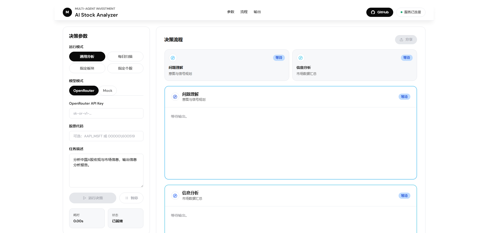
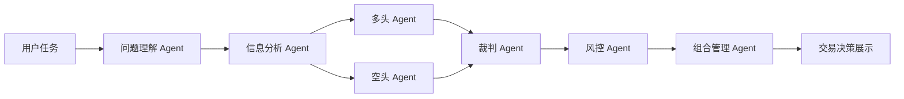

<div align="center">

# Multi-Agent Inv

面向股票研究、A 股扫描与投资决策复盘的多 Agent 分析工作台。

<a href="http://stock.supersaiyan.online/">在线体验</a>
·
<a href="#快速开始">快速开始</a>
·
<a href="#运行模式">运行模式</a>


  
  
  
  

</div>

---

## 目录

- [项目介绍](#项目介绍)
- [界面预览](#界面预览)
- [核心能力](#核心能力)
- [系统流程](#系统流程)
- [运行模式](#运行模式)
- [快速开始](#快速开始)
- [命令行使用](#命令行使用)
- [Docker 部署](#docker-部署)
- [配置说明](#配置说明)
- [项目结构](#项目结构)
- [开发与测试](#开发与测试)

## 项目介绍

Multi-Agent Inv 将一次股票研究拆成可追踪的 Agent 协作流程：先理解问题和选择数据源，再汇总市场信息，随后在 A 股决策模式下引入多头、空头、裁判、风控与组合管理视角，最终输出结构化分析和交易决策展示。

它适合做三件事：

- 把分散的行情、宏观、板块和公司信息整理成可阅读的研究报告。
- 用多空辩论和风控复核减少单一视角带来的判断偏差。
- 在 Web 页面中实时查看每个阶段的运行状态、数据来源和最终结论。

在线体验地址：

```text
http://stock.supersaiyan.online/
```

## 界面预览



## 核心能力

| 能力            | 说明                                                                               |
| --------------- | ---------------------------------------------------------------------------------- |
| 多 Agent 决策链 | 基于 LangGraph 编排问题理解、信息分析、多空辩论、裁判、风控、组合管理等节点。      |
| A 股自动扫描    | 支持每日扫描、指定板块、指定个股深度分析，结合资金规模和风险偏好生成决策展示。     |
| 多源数据采集    | 集成 A 股行情、指数、资金流、宏观、期权、Web 搜索等 provider，可按任务选择数据源。 |
| 流式前端展示    | FastAPI 通过 NDJSON 流式返回阶段进度，React 工作台展示过程、摘要、来源和最终输出。 |
| 本地与容器部署  | 支持源码运行、前端构建后由后端托管静态页面，也支持 Docker Compose 部署。           |

## 系统流程

通用分析模式会执行问题理解与信息分析；A 股决策模式会继续进入完整投资决策链。



| Agent    | 职责                                                 |
| -------- | ---------------------------------------------------- |
| 问题理解 | 解析用户意图、候选标的、市场范围和需要关注的数据源。 |
| 信息分析 | 拉取并整理行情、宏观、基本面、资金面和搜索信息。     |
| 多头     | 提炼上涨逻辑、催化因素和机会窗口。                   |
| 空头     | 反驳乐观假设，识别下行风险和数据缺口。               |
| 裁判     | 综合多空观点，形成更克制的中间判断。                 |
| 风控     | 检查回撤、止损、仓位和执行风险。                     |
| 组合管理 | 将判断转化为资金规模、仓位和交易计划。               |

## 运行模式

| 模式         | 前端选项 | 适合场景                                               |
| ------------ | -------- | ------------------------------------------------------ |
| 通用分析     | 通用分析 | 分析美股、ETF、A 股代码或市场问题，输出信息分析报告。  |
| A 股每日扫描 | 每日扫描 | 从 A 股市场中筛选候选机会，并生成价格触发式交易决策。  |
| A 股指定板块 | 指定板块 | 聚焦半导体、白酒、新能源等板块，寻找更具体的投资线索。 |
| A 股指定个股 | 指定个股 | 对单只或少量 A 股进行深度分析和交易策略生成。          |

## 快速开始

### 1. 安装后端依赖

```powershell
pip install -r requirements.txt
```

### 2. 构建前端

```powershell
cd web
npm install
npm run build
cd ..
```

### 3. 启动服务

```powershell
python -m uvicorn server:app --host 0.0.0.0 --port 8000
```

访问本地页面：

```text
http://127.0.0.1:8000/
```

健康检查：

```powershell
curl http://127.0.0.1:8000/api/health
```

## 命令行使用

通用股票分析：

```powershell
python main.py `
  --mode stock_decision `
  --symbols AAPL,MSFT,NVDA `
  --task "分析 AAPL、MSFT、NVDA 未来 1-3 个月的投资机会" `
  --config config.yaml `
  --openrouter-api-key "YOUR_OPENROUTER_API_KEY"
```

A 股每日扫描：

```powershell
python main.py `
  --mode a_share_daily `
  --task "扫描市场，找出未来 1 个月最具投资价值的 A 股股票" `
  --risk-tolerance moderate `
  --capital 1000000 `
  --config config.yaml `
  --openrouter-api-key "YOUR_OPENROUTER_API_KEY"
```

A 股指定板块：

```powershell
python main.py `
  --mode a_share_sector `
  --sectors 半导体 `
  --task "分析指定 A 股半导体板块并给出买入建议" `
  --config config.yaml `
  --openrouter-api-key "YOUR_OPENROUTER_API_KEY"
```

## Docker 部署

使用已有镜像：

```powershell
docker compose -f docker/docker-compose.yml up -d
```

当前 compose 文件将容器内 `8000` 端口映射到宿主机：

```text
127.0.0.1:18080
```

从源码构建镜像：

```powershell
cd web
npm install
npm run build
cd ..

docker build -t ai-stock:latest .
docker run -d --name ai-stock -p 8000:8000 ai-stock:latest
```

## 配置说明

默认配置文件是 `config.yaml`。主要关注这些配置：

| 配置                             | 说明                                                     |
| -------------------------------- | -------------------------------------------------------- |
| `agents.*.model`               | 配置各 Agent 使用的模型 provider、模型名和 temperature。 |
| `agents.information.collector` | 控制数据采集超时、并发、候选数量和启用的数据源。         |
| `providers.tushare`            | 配置 Tushare token、HTTP 地址和 A 股相关表。             |
| `providers.china_equity`       | 配置 Tencent、mootdx 等 A 股行情与公司信息来源。         |
| `providers.macro`              | 配置美债、汇率、恐惧贪婪指数等宏观信号。                 |

OpenRouter API Key 可以在前端运行时填写，也可以在命令行通过 `--openrouter-api-key` 传入。请不要把真实密钥提交到公开仓库。

## 项目结构

```text
.
├── agents/                 # 各角色 Agent 与提示词加载
├── collectors/             # 行情、宏观、Web、Tushare、mootdx 等数据采集
├── graph/                  # LangGraph 决策流程定义
├── prompts/                # Agent 提示词与参考资料
├── schemas/                # 运行状态与结构化数据类型
├── services/               # 模拟订单与交易计划服务
├── schedulers/             # 交易计划监控调度器
├── tests/                  # 后端测试
├── web/                    # React + Vite 前端
├── main.py                 # 命令行入口
├── server.py               # FastAPI Web 服务入口
└── config.yaml             # 默认 Agent 与数据源配置
```

## 开发与测试

后端测试：

```powershell
pytest
```

前端类型检查：

```powershell
cd web
npm run typecheck
```

前端开发服务器：

```powershell
cd web
npm run dev
```
